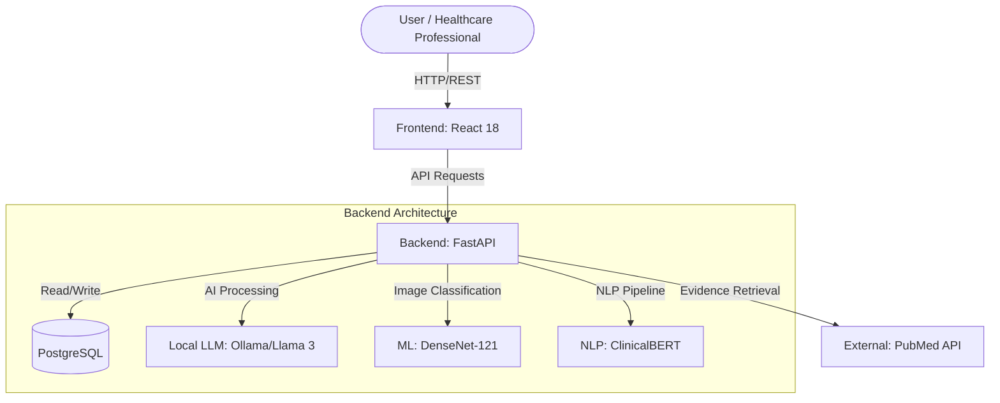

# SağlıkCebim

SağlıkCebim is a comprehensive, Turkish-language multimodal clinical decision support system designed to assist healthcare professionals. It integrates advanced machine learning models with a full-stack web application to analyze medical data, radiology images, and provide evidence-based clinical roadmaps.

## Architecture



## Tech Stack

| Category | Technologies Used |
|----------|-------------------|
| **Backend** | FastAPI, Python 3.11, SQLAlchemy, Pydantic, Passlib, JWT |
| **Frontend** | React 18, Vite, TypeScript, TailwindCSS, Axios |
| **Database** | PostgreSQL 15 |
| **AI / ML** | DenseNet-121 (Radiology), Llama 3 via Ollama, ClinicalBERT |
| **DevOps** | Docker, Docker Compose, Nginx |

## Prerequisites

Before you begin, ensure you have the following installed:
- **Docker & Docker Compose** (Required for containerized setup)
- **Node.js** (v20+ recommended, if running frontend locally)
- **Python** (v3.11+, if running backend locally)
- **Ollama** (Required for local LLM execution)

## Setup Instructions

### 1. Clone the Repository
```bash
git clone https://github.com/yourusername/saglikcebim.git
cd saglikcebim
```

### 2. Environment Variables
Copy the example environment file and update the variables:
```bash
cp .env.example .env
```
Make sure to configure the `SECRET_KEY`, `POSTGRES_PASSWORD`, and Ollama variables.

### 3. Start the Application
Run the entire stack (Database, Backend, Frontend, and Ollama) using Docker Compose:
```bash
docker-compose up --build -d
```
The application will be accessible at:
- **Frontend**: http://localhost:3000
- **Backend API Docs**: http://localhost:8000/docs
- **Ollama API**: http://localhost:11434

## API Endpoint Reference

| Method | Path | Description | Auth Required |
|--------|------|-------------|---------------|
| `POST` | `/auth/register` | Register a new user | No |
| `POST` | `/auth/login` | Authenticate and get JWT token | No |
| `GET`  | `/auth/me` | Get current user profile | Yes |
| `POST` | `/reports/upload` | Upload PDF/Image lab reports | Yes |
| `POST` | `/radiology/upload` | Upload X-ray for DenseNet analysis | Yes |
| `POST` | `/api/v1/chatbot/chat` | Chat with the personalized clinical AI | Yes |
| `GET`  | `/articles/daily` | Fetch daily medical articles from PubMed | Yes |
| `GET`  | `/health` | API health check | No |

## Machine Learning Models

- **DenseNet-121**: A convolutional neural network used for classifying and analyzing chest X-ray images, providing rapid diagnostic suggestions for radiology uploads.
- **Llama 3 (via Ollama)**: The core Large Language Model that drives the multi-agent chatbot and clinical roadmap generation, specifically tuned for medical reasoning.
- **ClinicalBERT**: Used within the NLP pipeline to accurately extract and contextualize clinical entities from raw text and lab reports.

## Screenshots

*(Placeholders for screenshots)*
- **Dashboard**: 
- **Radiology Analysis**: 
- **Clinical Chatbot**: 

## License

This project is licensed under the MIT License - see the [LICENSE](LICENSE) file for details.
