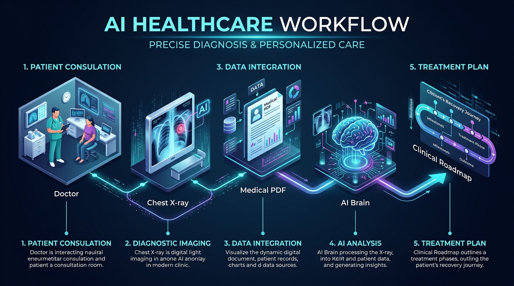
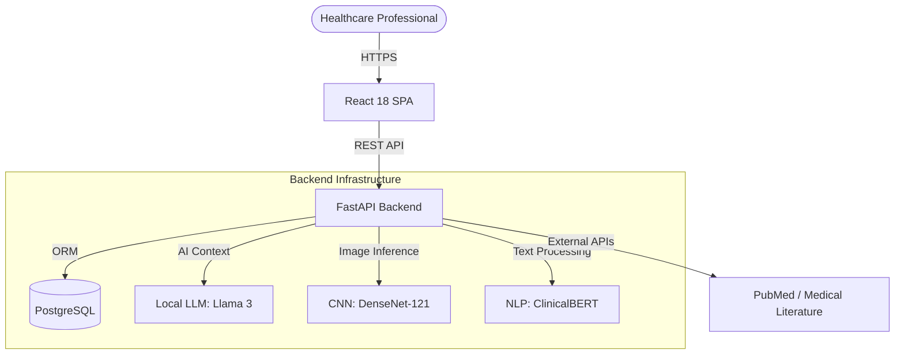

<div align="center">
  

  # SağlıkCebim
  **Multimodal Clinical Decision Support System & AI Medical Assistant**

  [](https://fastapi.tiangolo.com/)
  [](https://reactjs.org/)
  [](https://www.postgresql.org/)
  [](https://www.docker.com/)
  [](https://ollama.com/)
  [](https://opensource.org/licenses/MIT)

</div>

---

> [!CAUTION]
> **Medical Disclaimer:** This project is a prototype developed for academic/demonstration purposes only. It is **not** intended to replace professional medical advice, diagnosis, or treatment. Always seek the advice of a qualified healthcare provider with any questions you may have regarding a medical condition.

## 📖 Overview

**SağlıkCebim** is an advanced, Turkish-language medical assistant and clinical decision support system (CDSS). By seamlessly integrating state-of-the-art Natural Language Processing (NLP), Convolutional Neural Networks (CNN), and a modern web interface, the platform empowers healthcare professionals by automating clinical history taking, analyzing radiology images, and proposing evidence-based treatment roadmaps.

## ✨ Key Features

- 🤖 **Multi-Agent Clinical Chatbot**: Powered by a locally hosted **Llama 3** (via Ollama) and an underlying `ClinicalRoadmapEngine`, it conducts dynamic anamnesis and handles complex medical inquiries.
- 🩻 **Radiology AI (DenseNet-121)**: Upload chest X-rays to instantly receive probability scores for conditions like Pneumonia or Cardiomegaly, complete with diagnostic confidence scoring.
- 📄 **Intelligent PDF/Report Parser**: Leverages **ClinicalBERT** to parse raw medical lab reports, extracting key findings, abnormal metrics, and generating structural data for the clinical roadmap.
- 🔗 **PubMed Evidence Integration**: Automatically queries external medical databases (e.g., PubMed) to anchor clinical advice in up-to-date scientific literature.
- 🛡️ **Secure & Compliant Architecture**: Designed with robust JWT authentication, password hashing, and separated dataset environments to respect patient data privacy (KVKK/GDPR).

---

## 🏗️ System Architecture





---

## 🛠️ Tech Stack

### Backend
* **Framework:** Python 3.11, FastAPI
* **Database:** PostgreSQL, SQLAlchemy, Alembic
* **Security:** JWT, passlib, pbkdf2_sha256
* **Testing:** Pytest

### Frontend
* **Core:** React 18, TypeScript, Vite
* **Styling:** Tailwind CSS, Shadcn UI
* **State/Routing:** React Router DOM, Axios

### AI & Machine Learning
* **Language Models:** Ollama (Llama 3), Hugging Face (ClinicalBERT)
* **Computer Vision:** PyTorch, Torchvision (DenseNet-121)

---

## 🚀 Quick Start

The easiest way to run SağlıkCebim locally is using Docker.

### Prerequisites
* Docker & Docker Compose
* Ollama (Running locally if you intend to test the LLM chatbot)

### 1. Clone the repository
```bash
git clone https://github.com/TITANBGG/SaglikCebim.git
cd SaglikCebim
```

### 2. Configure Environment
A robust `setup.ps1` script is provided for Windows users, which automatically handles `.env` creation with secure cryptographic secrets:
```powershell
.\setup.ps1 -Mode docker
```

*(For manual setup without PowerShell, copy `.env.example` to `.env` and configure your credentials).*

### 3. Build and Run
```bash
docker-compose up --build -d
```
* **Frontend:** [http://localhost:5173](http://localhost:5173) (or `http://localhost` depending on config)
* **Backend API Docs:** [http://localhost:8000/docs](http://localhost:8000/docs)

---

## 📂 Datasets & Sample Data

To ensure maximum repository performance and comply with data privacy standards, **large datasets and real patient databases are intentionally excluded from this repository.**
- **Full Dataset**: Hosted separately.
- **Local Testing**: A `sample_data/` directory is provided. You can place your dummy X-ray images and test PDF reports there to safely test the AI pipelines locally without accidentally committing them.

## 📸 Screenshots

### 1. Medical Dashboard


### 2. Radiology AI Analysis


### 3. Clinical Chatbot & Roadmap


---

## 🧪 Running Tests

The backend is fully tested using `pytest`. The test suite covers e2e flows, auth, chatbots, and AI pipelines.
```bash
cd backend
pytest tests/ -v
```
*(Continuous Integration is also configured via GitHub Actions to automatically run linters and tests on every push).*

---

## 🤝 Contributing

Contributions are what make the open-source community such an amazing place to learn, inspire, and create. Any contributions you make are **greatly appreciated**.

1. Fork the Project
2. Create your Feature Branch (`git checkout -b feature/AmazingFeature`)
3. Commit your Changes (`git commit -m 'Add some AmazingFeature'`)
4. Push to the Branch (`git push origin feature/AmazingFeature`)
5. Open a Pull Request

Please refer to [CONTRIBUTING.md](CONTRIBUTING.md) for detailed guidelines.

## 📝 License

Distributed under the MIT License. See `LICENSE` for more information.

---
*Developed with ❤️ as a comprehensive graduation project demonstrating the power of AI in clinical workflows.*
