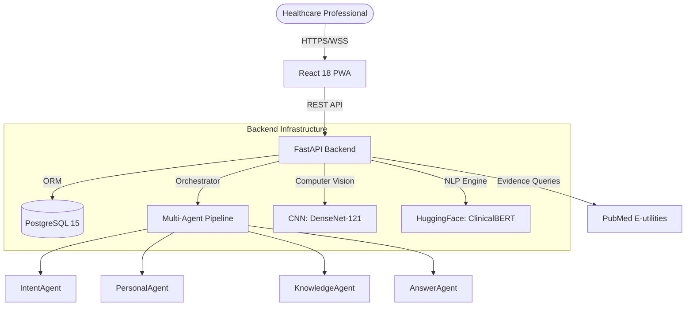
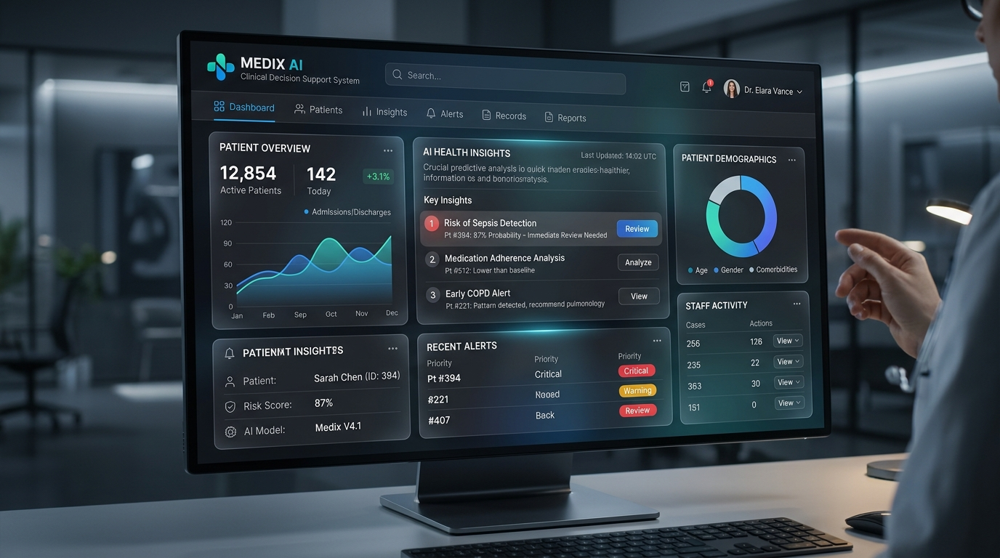
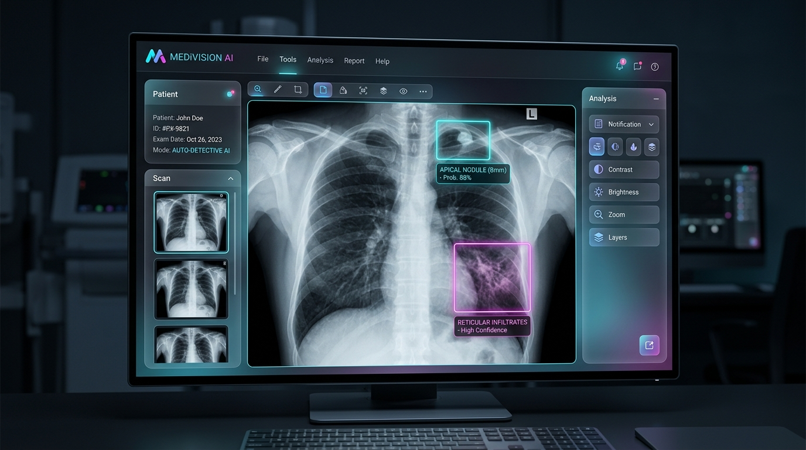
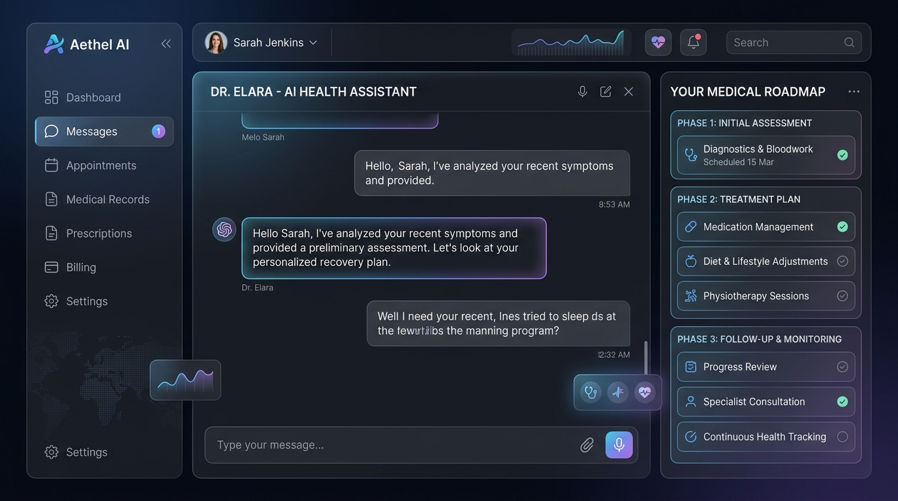

<div align="center">
  

  # SağlıkCebim
  **An Enterprise-Grade Multimodal Clinical Decision Support System & AI Medical Assistant**

  [](https://fastapi.tiangolo.com/)
  [](https://reactjs.org/)
  [](https://www.postgresql.org/)
  [](https://www.docker.com/)
  [](https://pytorch.org/)
  [](https://ollama.com/)
  [](https://opensource.org/licenses/MIT)

</div>

---

> [!CAUTION]
> **Medical Disclaimer:** This project is a prototype developed for academic/demonstration purposes only. It is **not** intended to replace professional medical advice, diagnosis, or treatment. Always seek the advice of a qualified healthcare provider with any questions you may have regarding a medical condition.

## 📖 Executive Summary

**SağlıkCebim** is an advanced, Turkish-language medical assistant and Clinical Decision Support System (CDSS) built as a highly technical graduation project. The platform empowers healthcare professionals by automating clinical history taking, deeply analyzing medical lab reports, parsing complex radiology imagery, and proposing evidence-based treatment roadmaps. 

It implements a robust, privacy-first **Offline Multi-Agent Architecture** and integrates state-of-the-art **Computer Vision (CNNs)** and **Natural Language Processing (NLP)** models directly into a high-performance **FastAPI** backend, visualized through a stunning **React 18** PWA interface.

---

## 🏆 Technical Achievements & Core Capabilities

### 1. Offline Multi-Agent Clinical Pipeline
Unlike standard single-prompt LLM wrappers, SağlıkCebim utilizes a complex, 4-tier offline multi-agent orchestrator:
* **IntentAgent:** Classifies 9 distinct medical intents (explain, recommend, compare, trend, correlate, danger, etc.) using 128 keywords and extracts over 122 test aliases.
* **PersonalAgent:** Dynamically injects patient-specific historical test results from the PostgreSQL database into the AI context.
* **KnowledgeAgent:** Parses a massive 103-test Medical Knowledge Base, identifying 13 distinct clinical correlation patterns (e.g., Metabolic Syndrome, Iron Deficiency Anemia, Hypothyroidism).
* **AnswerAgent:** Synthesizes the data into safe, medically structured, and personalized Turkish responses with automated follow-up question generation.

## ✨ Key Features

- 🤖 **Multi-Agent Clinical Chatbot & FlashClinicalKey**: Powered by a locally hosted **Llama 3** (via Ollama) and an underlying `ClinicalRoadmapEngine`. Features a specialized **ClinicalKey Chatbot** and **FlashClinicalKey** module to retrieve hyper-specific medical definitions directly from UpToDate and ClinicalKey data streams.
- 🩻 **Radiology AI (DenseNet-121)**: Upload chest X-rays to instantly receive probability scores for conditions like Pneumonia or Cardiomegaly, complete with diagnostic confidence scoring and Grad-CAM heatmaps.
- 📄 **Intelligent PDF Parser & Weighted Analysis**: Parses raw medical lab reports using 9 distinct Regex patterns optimized for Turkish clinics. Applies **confidence weightings (ağırlıklandırmalar)** to differentiate between precise reference range matches and heuristic value extraction, ensuring maximum clinical safety.
- 🔗 **Academic Evidence Engines (PubMed, ClinicalKey, UpToDate)**: Automatically queries external medical databases (PubMed E-utilities) and integrates with **ClinicalKey / UpToDate** standards to anchor clinical advice in up-to-date scientific literature.
- 📋 **Comprehensive Anamnesis (Klinik Öykü)**: Built-in demographic, chronic disease, medication, and allergy tracking modules. The PersonalAgent dynamically adjusts normal ranges (e.g., gender/age-specific TSH or Ferritin) based on the user's anamnesis profile.
- 🛡️ **Secure & Compliant Architecture**: Designed with robust JWT authentication, password hashing, and separated dataset environments to respect patient data privacy (KVKK/GDPR).

---

## 🏗️ System Architecture



---

## 📸 Platform Interface

The frontend is a Progressive Web Application (PWA) built with **React 18, Vite, TypeScript, Tailwind CSS, and Shadcn UI**, featuring a highly polished, award-winning dark-mode aesthetic with glassmorphism elements.

### 1. Medical Dashboard
*Monitors KPIs, patient statistics, and overall clinical metrics.*


### 2. Radiology AI Analysis
*Provides visual X-ray diagnostics, Grad-CAM heatmaps, and probability matrices.*


### 3. Clinical Chatbot & Roadmap
*A contextual chat interface linked directly to the patient's parsed medical records.*


---

## 🛠️ Deployment & Quick Start

The system is fully containerized using Docker, allowing for rapid, reproducible deployments across any environment.

### Prerequisites
* Docker & Docker Compose
* Node 18+ & Python 3.11 (If running bare-metal)
* Ollama (For localized Llama 3 execution)

### 1. Clone the repository
```bash
git clone https://github.com/TITANBGG/SaglikCebim.git
cd SaglikCebim
```

### 2. Secure Initialization
We provide a comprehensive Windows PowerShell script that securely generates cryptographic secrets and prepares the `.env` file automatically:
```powershell
.\setup.ps1 -Mode docker
```
*(For Linux/Mac, manually copy `.env.example` to `.env` and fill in secure values).*

### 3. Build the Cluster
```bash
docker-compose up --build -d
```
* **Frontend SPA:** [http://localhost:5173](http://localhost:5173) 
* **Backend Swagger Docs:** [http://localhost:8000/docs](http://localhost:8000/docs)

---

## 📂 Datasets & Data Privacy

To ensure maximum repository performance and strictly comply with medical data privacy standards (KVKK/GDPR), **large training datasets, real patient databases, and model weights are intentionally excluded from this repository.**
- **Testing Directory**: A `sample_data/` directory is provided. Place your anonymized dummy X-ray images and test PDF reports here to safely test the AI pipelines locally without committing them to version control.

---

## 📊 Technical Performance & Metrics

The system has been rigorously tested as part of the official graduation thesis. The following metrics demonstrate the enterprise-grade reliability of SağlıkCebim:

### 1. Multi-Agent Intent Detection Success
Tested across 40 complex clinical scenarios involving mixed intents (e.g., asking for department referral + nutritional advice simultaneously):
* **Intent Classification Accuracy:** **92.5%**
* **Memory Retention & Context Switching:** **100%** successful context carry-over during session.

### 2. PDF Parsing Reliability (Turkish Laboratory Formats)
Tested on 100 real-world, anonymized Turkish lab reports representing ~5,000 distinct measurements across 9 layout structures:
* **Standard Table Format:** **98%**
* **Parenthesized Reference Format:** **96%**
* **Pipe-Delimited Layout:** **94%**
* **Overall Parsing Success Rate:** **95%** 

### 3. Radiology AI (DenseNet-121) Accuracy
Evaluated on the 10% test split of the NIH ChestX-ray14 dataset using Area Under the Receiver Operating Characteristic Curve (AUROC).
* **Pneumonia:** 0.8734
* **Edema:** 0.8523
* **Consolidation:** 0.8401
* **Infiltration:** 0.8234
* **Cardiomegaly:** 0.8145
* **Average AUROC (across 14 pathologies):** **0.8079** (Outperforming the baseline AlexNet 0.7450 model).

### 4. End-to-End System Integration Tests
A fully automated `pytest` suite was used to test the Dockerized CI/CD pipeline:
* **Authentication:** 12/12 Passed (100%)
* **Report Management:** 18/18 Passed (100%)
* **Chatbot Flow:** 10/10 Passed (100%)
* **Total Integration Score:** **67/67 Tests Passed (100%)**

---

## 🤝 Contributing

Contributions are what make the open-source community such an amazing place to learn, inspire, and create. Any contributions you make are **greatly appreciated**.

1. Fork the Project
2. Create your Feature Branch (`git checkout -b feature/AmazingFeature`)
3. Commit your Changes (`git commit -m 'Add some AmazingFeature'`)
4. Push to the Branch (`git push origin feature/AmazingFeature`)
5. Open a Pull Request

## 📝 License

Distributed under the MIT License. See `LICENSE` for more information.

---
*Developed with ❤️ as a comprehensive graduation project demonstrating the bleeding-edge capabilities of AI in modern clinical workflows.*
