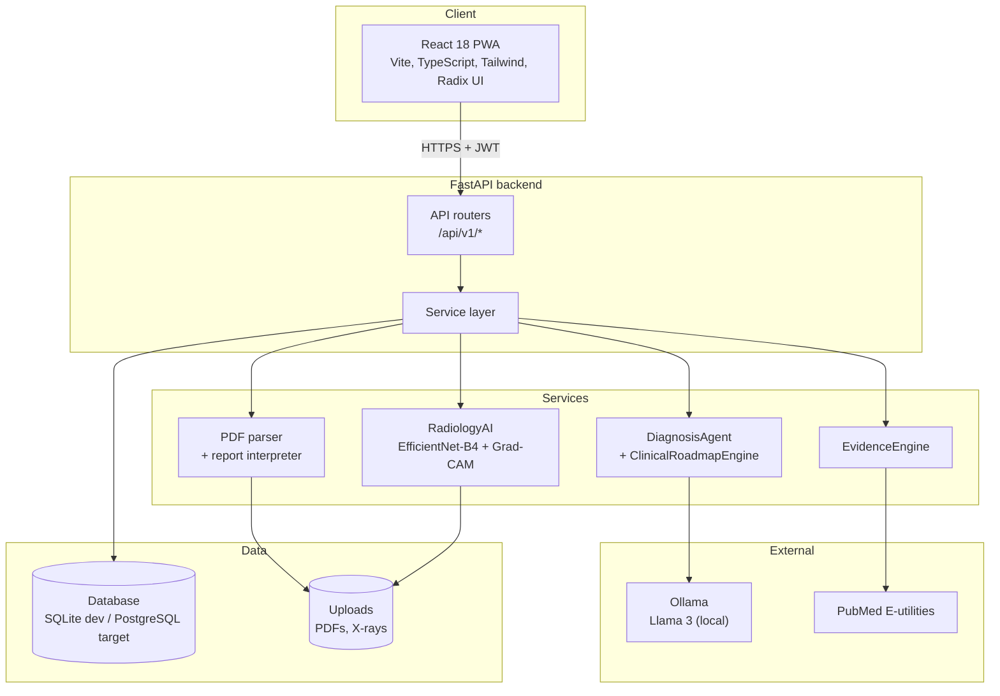
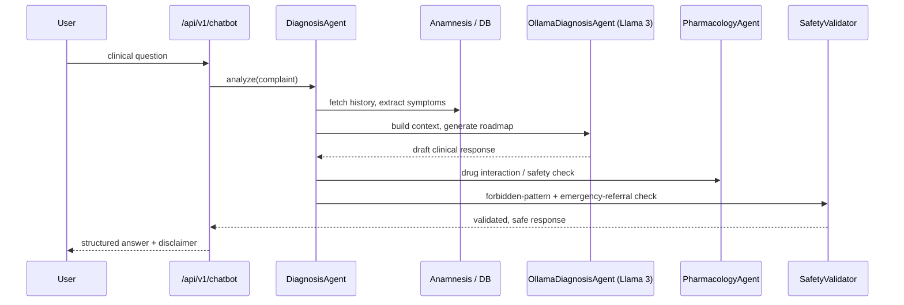

https://youtu.be/Gd3x-HQGDXs


<div align="center">
  

  <h1>SağlıkCebim</h1>
  <p><strong>Turkish-language Clinical Decision Support System and offline AI medical assistant.</strong></p>
  <p>Lab report parsing, chest X-ray analysis, and a multi-agent clinical chat pipeline, backed by evidence retrieval.</p>

  <p>
    
    
    
    
    
    
    
    
    
  </p>
</div>

---

> [!CAUTION]
> **Medical disclaimer.** This project is a prototype built for academic and demonstration purposes. It is not a medical device and must not be used to replace professional diagnosis, advice, or treatment. Always consult a qualified healthcare provider.

## Overview

SağlıkCebim is a Turkish clinical assistant that turns raw patient inputs into structured, safety-checked guidance. It reads lab report PDFs, analyzes chest X-rays, and answers clinical questions through a multi-agent pipeline, with every recommendation passed through a safety layer before it reaches the user.

The system is designed to be **offline and privacy-first**: the language model runs locally through [Ollama](https://ollama.com) (Llama 3), so patient text does not have to leave the host. It is **multimodal**, combining free-text symptoms, parsed lab values, and radiology images. The backend is a **FastAPI** service; the frontend is a **React 18** Progressive Web App.

This is a graduation project. The architecture is real and runnable, but see [Known limitations](#known-limitations) for what is production-ready versus what is still a prototype.

## Key features

- **Lab report analysis** parses Turkish medical PDFs with `pdfplumber` and a set of Turkish-tuned regex patterns, then interprets values against reference ranges. (`services/pdf_parser.py`, `services/report_interpreter.py`, `services/medical_knowledge.py`)
- **Radiology AI** classifies chest X-rays across the 14 NIH ChestX-ray14 findings and returns per-class probabilities with Grad-CAM heatmaps for explainability. (`services/radiology_ai.py`, `ml/`)
- **Multi-agent clinical chat** orchestrates symptom extraction, patient history, a local LLM, a pharmacology firewall, and a safety validator into a single clinical response. (`services/diagnosis_agent.py`, `services/clinical/`)
- **Evidence retrieval** queries external medical sources through pluggable providers (PubMed E-utilities, UpToDate, ClinicalKey) and ranks results with BM25. (`services/evidence/`)
- **Anamnesis (clinical history)** tracks demographics, chronic conditions, medications, and allergies, and uses them to contextualize interpretation. (`api/v1/anamnesis.py`)
- **Auth and safety** JWT authentication, `pbkdf2_sha256` password hashing, per-user data isolation on reports, request rate limiting, and Web Push notifications. (`core/security.py`, `api/v1/auth.py`, `main.py`)

## System architecture



### Clinical chat request flow



## Multi-agent clinical pipeline

The chat pipeline is an orchestration of small, single-purpose components rather than one large prompt:

- **`DiagnosisAgent`** is the orchestrator. It extracts symptoms from the message, pulls the patient's anamnesis from the database, and coordinates the downstream steps.
- **`ClinicalRoadmapEngine`** builds the structured clinical roadmap and enriches it via `ClinicalKeyAgent`.
- **`OllamaDiagnosisAgent`** talks to the locally hosted Llama 3 model through the Ollama HTTP API, with retry handling and optional JSON-mode output.
- **`PharmacologyAgent`** acts as a firewall that checks for medication and interaction safety before a response is finalized.
- **`SafetyValidator`** is the final gate. It scans the output for forbidden patterns (dosages, drug names, "no doctor needed" phrasing) and enforces emergency referral when red flags or critical risk are present.

## Radiology AI

- **Model.** `EfficientNet-B4` (torchvision) with a 14-output classifier head, loaded from a checkpoint at `backend/models/`.
- **Labels.** The 14 NIH ChestX-ray14 findings: Atelectasis, Cardiomegaly, Effusion, Infiltration, Mass, Nodule, Pneumonia, Pneumothorax, Consolidation, Edema, Emphysema, Fibrosis, Pleural Thickening, and Hernia, with Turkish display names.
- **Thresholds.** Per-class decision thresholds are loaded from a JSON file rather than a single fixed 0.5 cutoff.
- **Explainability.** Grad-CAM heatmap overlays highlight the regions driving each prediction. (`ml/gradcam.py`)
- **Training and evaluation.** The `ml/` directory contains the full pipeline: dataset preparation, augmentation, training (`train.py`, `train_v2.py`), export, and evaluation scripts including ECE calibration (`evaluate_ece.py`).

## Evidence engines

Clinical advice can be anchored to external literature through provider abstractions in `services/evidence/`:

- **PubMed** via the NCBI E-utilities API.
- **UpToDate** and **ClinicalKey** via configurable providers (these require credentials or cookies supplied through environment variables).
- Retrieved passages are ranked with **BM25** (`rank-bm25`) before being surfaced.

## Tech stack

| Layer | Technology | Version | Purpose |
| --- | --- | --- | --- |
| Backend | FastAPI | 0.100+ | REST API and OpenAPI docs |
| Backend | SQLAlchemy | 2.0+ | ORM |
| Backend | Alembic | 1.13+ | Database migrations |
| Auth | python-jose, passlib | 3.5 / 1.7.4 | JWT and password hashing |
| Parsing | pdfplumber, regex | 0.11.9 | Turkish lab PDF extraction |
| LLM | langchain-ollama, Ollama | 1.1+ | Local Llama 3 inference |
| Vision | PyTorch, torchvision | 2.1+ | EfficientNet-B4 X-ray model |
| Retrieval | rank-bm25 | 0.2.2+ | Evidence ranking |
| Rate limit | slowapi | 0.1.9+ | Per-route request limits |
| Frontend | React | 18.3.1 | PWA UI |
| Frontend | Vite, TypeScript | latest | Build and typing |
| Frontend | Tailwind CSS, Radix UI, MUI | - | Styling and components |
| Frontend | recharts | 2.15 | Charts and trends |
| Infra | Docker, PostgreSQL, Nginx | 15 / alpine | Containerized deployment |

## Project structure

<details>
<summary><b>📂 Click to expand repository structure</b></summary>

```text
SaglikCebim/
├── backend/
│   ├── app/
│   │   ├── api/v1/          # Routers: auth, reports, radiology, chatbot, anamnesis, ...
│   │   ├── core/            # database, security, config, logging
│   │   ├── services/        # diagnosis_agent, pdf_parser, radiology_ai, report_interpreter
│   │   │   ├── clinical/    # roadmap engine, safety validator, pharmacology agent
│   │   │   └── evidence/    # pubmed / uptodate / clinicalkey providers, BM25 ranker
│   │   ├── models/          # SQLAlchemy models
│   │   └── main.py          # FastAPI app entrypoint
│   ├── ml/                  # X-ray training, evaluation, Grad-CAM
│   ├── tests/               # 28 test modules (pytest)
│   └── requirements.txt
├── frontend/
│   ├── src/app/pages/       # Dashboard, Radyoloji, PDFAnaliz, Anamnez, Trendler, ...
│   └── package.json
├── docker-compose.yml       # Dev stack
├── docker-compose.prod.yml  # Prod stack (Postgres + Nginx)
└── README.md
```

</details>

## Getting started

### Prerequisites

- **Python 3.11**
- **Node.js 22**
- **Docker** and Docker Compose (for the containerized path)
- **Ollama** with the Llama 3 model pulled locally:
  ```bash
  ollama pull llama3
  ```

### Environment variables

The backend reads configuration from environment variables (loaded from `backend/.env`). Create a `.env.example` and copy it to `.env`. **Never commit real secrets.**

<details>
<summary><b>⚙️ Click to view all Environment Variables</b></summary>

| Variable | Required | Default | Purpose |
| --- | --- | --- | --- |
| `SECRET_KEY` | Yes | none (app fails if unset) | JWT signing key |
| `ALGORITHM` | No | `HS256` | JWT algorithm |
| `ACCESS_TOKEN_EXPIRE_MINUTES` | No | `30` | Token lifetime |
| `CORS_ALLOW_ORIGINS` | Yes (dev) | empty | Comma-separated allowed origins |
| `CORS_ALLOW_ORIGIN_REGEX` | No | none | Regex alternative for CORS |
| `OLLAMA_BASE_URL` | No | `http://localhost:11434` | Ollama endpoint |
| `OLLAMA_MODEL` | No | `llama3:latest` | Local model tag |
| `OLLAMA_TIMEOUT` | No | `120` | LLM request timeout (s) |
| `PUBMED_EMAIL` | No | placeholder | Contact for NCBI E-utilities |
| `UPTODATE_API_KEY` | No | empty | UpToDate provider auth |
| `CLINICALKEY_COOKIE` | No | empty | ClinicalKey provider auth |
| `LOG_LEVEL` | No | `INFO` | Logging verbosity |
| `VAPID_PUBLIC_KEY` / `VAPID_PRIVATE_KEY` / `VAPID_EMAIL` | For push | none | Web Push notifications |
| `DATABASE_URL` | See note | `sqlite:///./dev.db` | Database connection (see [Known limitations](#known-limitations)) |

Example `.env`:

```env
SECRET_KEY=change-me-to-a-long-random-string
ACCESS_TOKEN_EXPIRE_MINUTES=30
CORS_ALLOW_ORIGINS=http://localhost:5173
OLLAMA_BASE_URL=http://localhost:11434
OLLAMA_MODEL=llama3:latest
```

</details>

### Run locally (without Docker)

Backend:

```bash
cd backend
python -m venv .venv && source .venv/bin/activate   # Windows: .venv\Scripts\activate
pip install -r requirements.txt
uvicorn app.main:app --reload --port 8000
```

Frontend:

```bash
cd frontend
npm install
npm run dev
```

The API is then at `http://localhost:8000` and the app at the Vite dev URL.

### Run with Docker

Development stack:

```bash
docker compose up --build
```

Production stack (PostgreSQL + Nginx). Provide a `.env` with the production values first:

```bash
docker compose -f docker-compose.prod.yml up --build
```

## API reference

Interactive documentation is generated automatically:

- **Swagger UI:** `http://localhost:8000/docs`
- **ReDoc:** `http://localhost:8000/redoc`

<details>
<summary><b>🌐 Click to view Key API Endpoints</b></summary>

| Group | Prefix | Responsibility |
| --- | --- | --- |
| Auth | `/api/v1/auth` | Register, login, current user |
| Reports | `/api/v1/reports` | Upload, list, parse, interpret lab PDFs |
| Radiology | `/api/v1/radiology` | X-ray upload and analysis |
| Chatbot | `/api/v1/chatbot` | Multi-agent clinical chat |
| Anamnesis | `/api/v1/anamnesis` | Clinical history management |
| Evidence | `/api/v1/evidence` | Literature retrieval |
| Roadmap | `/api/v1/roadmap` | Clinical roadmap sessions |
| Notifications | `/api/v1/notifications` | Web Push notifications |


</details>

## Testing

The backend ships with 28 pytest modules covering the PDF parser, agents, radiology inference, auth, report interpretation, safety validation, and end-to-end and golden-scenario flows.

```bash
cd backend
pytest
```

## Known limitations

This is a prototype, and the README aims to describe it honestly:

- **Database.** `core/database.py` currently hardcodes a SQLite connection and does not read `DATABASE_URL` from the environment yet, even though `docker-compose.prod.yml` provisions PostgreSQL 15. SQLite is the working default; wiring the app to read `DATABASE_URL` is required before the Postgres path is truly active.
- **Not for clinical use.** The models and safety layer are for demonstration. Outputs are not validated for real patient care.
- **External providers.** UpToDate and ClinicalKey integrations require credentials that are not bundled; without them, evidence retrieval falls back to PubMed.

## Security and privacy

- JWT-based authentication with `pbkdf2_sha256` password hashing.
- Per-user isolation on report queries (`Report.user_id` filtering) to prevent cross-account access.
- Per-route rate limiting via `slowapi`.
- Local LLM inference to keep patient text on the host.
- The project targets KVKK and GDPR alignment as a design goal.

## License

Released under the [MIT License](LICENSE).

## Acknowledgments

Built as a graduation project. Chest X-ray classification is trained on the NIH ChestX-ray14 dataset; literature retrieval uses the NCBI PubMed E-utilities.
